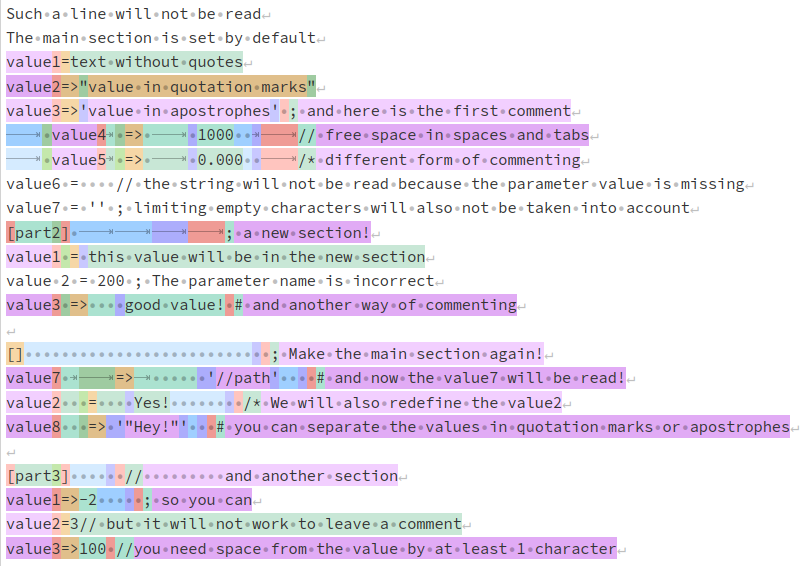

<p align="center">
    
</p>

<h1 align="center">readconf</h1>

[](https://www.gnu.org/licenses/old-licenses/gpl-2.0.html)
[](https://git.zhirov.kz/dlang/readconf)
[](https://github.com/AlexanderZhirov/readconf)
[](https://code.dlang.org/packages/readconf)

Singleton for reading the configuration file required for your program.

## What can do

1. Separation of parameter and value by separators `=` and `=>`
2. Commenting on lines using special characters `;`, `#`, `//`, `/*`
3. Support for sections for describing parameter blocks (sections are set by the name in `[]`)
4. Support for spaces and tabs for visual separation

## Quick start

The `settings.conf` file (see the [tests](tests/)):



Read `settings.conf` file:

```d
import readconf;
import std.stdio;

void main()
{
    rc.read("./settings.conf");

    foreach (key, param; rc.sn.keys())
        writefln("%s => %s", key, param);

    writeln(rc.sn.key("value1"));

    foreach (key, param; rc.sn("part2").keys())
        writefln("%s => %s", key, param);

    writeln(rc.sn("part2").key("value1"));
}
```

Result:

```
value1 => text without quotes
value2 => Yes!
value3 => value in apostrophes
value4 => 1000
value5 => 0.000
value7 => //path
value8 => "Hey!"
text without quotes
value1 => this value will be in the new section
value3 => good value!
this value will be in the new section
```

## Dub

Add a dependency on `"readconf": "~>0.2.0"`
