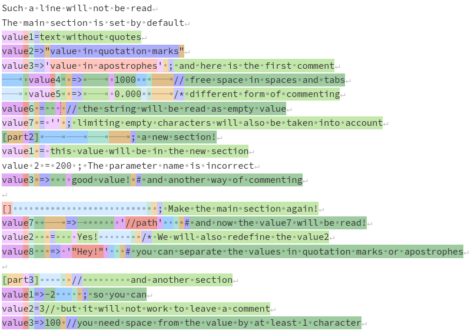

# readconf

Singleton for reading the configuration file required for your program.

## Quick start

The `settings.conf` file (see the [tests](tests/)):



Read `settings.conf` file:

```d
import readconf;
import std.stdio;

void main()
{
    rc.read("./settings.conf");

    foreach (key, param; rc.sn.keys())
        writefln("%s => %s", key, param);

    writeln(rc.sn.key("value1"));

    foreach (key, param; rc.sn("part2").keys())
        writefln("%s => %s", key, param);

    writeln(rc.sn("part2").key("value1"));
}
```

Result:

```
value1 => text without quotes
value2 => Yes!
value3 => value in apostrophes
value4 => 1000
value5 => 0.000
value7 => //path
value8 => "Hey!"
text without quotes
value1 => this value will be in the new section
value3 => good value!
this value will be in the new section
```
